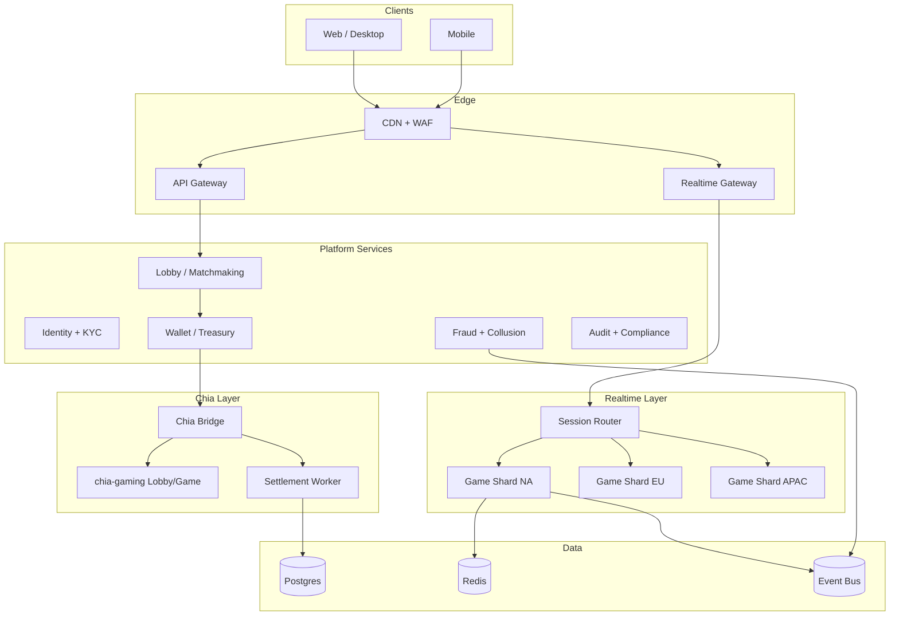

# Architecture

## Design principles

1. **Off-chain speed, on-chain trust** — Betting actions run on authoritative game servers (single-digit ms). Value custody, session open/close, and disputes use Chia.
2. **Event-sourced hands** — Every action is an append-only event with monotonic `seq` for replay, audit, and settlement proofs.
3. **Hybrid Chia modes** — Head-to-head (2-player) uses [chia-gaming](https://github.com/Chia-Network/chia-gaming) state channels; ring games and MTTs batch settlement to chain.
4. **Regional scale-out** — Game shards per geography; global control plane for identity, lobby, and treasury.

## Logical components

## Game loop (ring / MTT)

1. Player joins table via API; buy-in reserved in platform ledger (future: on-chain escrow).
2. Hand starts → server publishes `commitHash` before deal.
3. Players submit entropy seeds → server reveals seed, shuffles, deals.
4. Actions validated by `game-engine`; events broadcast via gateway.
5. Showdown → engine computes winners; settlement worker builds `SettlementProof` and optionally anchors on Chia.

## Game loop (head-to-head / Calpoker)

1. Platform creates chia-gaming lobby room via `ChiaGamingClient`.
2. Players connect wallets (WalletConnect) and open state channel.
3. Moves exchanged off-chain (potato protocol); platform mirrors events for analytics only.
4. Session close → single on-chain payout transaction.

## Trust model

| Concern | Mechanism |
|---------|-----------|
| Deck fairness | Commit-reveal + player seeds + deterministic shuffle |
| Action integrity | Server-authoritative with signed client intents (future) |
| Payout correctness | Settlement proofs + optional on-chain referee (chia-gaming) |
| Collusion | Behavioral ML, device graph, table isolation (planned) |

## Repository mapping (current vs planned)

| Component | Status |
|-----------|--------|
| `packages/game-engine` | MVP NLHE + evaluator |
| `packages/chia-bridge` | Lobby HTTP adapter + settlement hashes |
| `services/api` | Table CRUD, variants |
| `services/gateway` | WS scaffold |
| Postgres / Redis / Kafka | Planned |
| Mobile / Web UI | Planned |
| KYC / AML | Planned |
