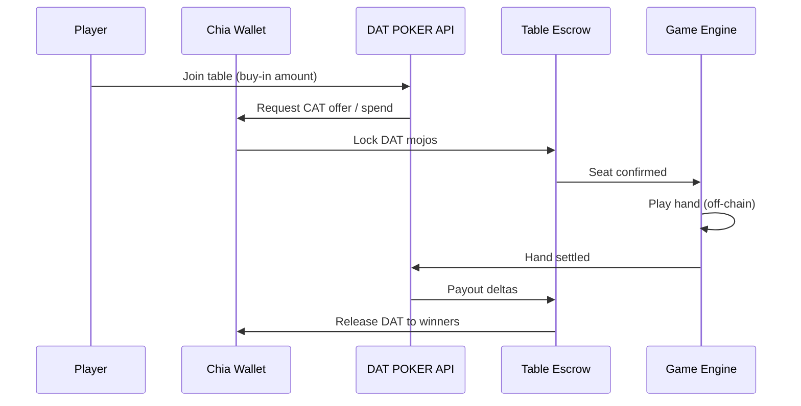

# DAT Governance Token

DAT POKER uses the **DAT Governance Token** as the primary in-game currency for:

- Cash game buy-ins and rebuys
- Tournament entries (planned)
- Promotional rewards and governance-linked perks (planned)

## What it is on Chia

The DAT Governance Token is a **Chia Asset Token (CAT)** — a fungible token on the Chia blockchain, controlled by a TAIL (Token and Asset Issuance Limitations) program.

- Players hold DAT in a standard Chia wallet (Sage, official light wallet, etc.).
- Buy-ins transfer DAT CAT coins into table/tournament escrow (platform or state-channel puzzles).
- Settlements return DAT winnings to player wallets.

Reference: [Chia CAT documentation](https://docs.chia.net/academy-cat/)

## Configuration

Set these in `.env` (see `.env.example`):

| Variable | Description |
|----------|-------------|
| `DAT_GOVERNANCE_TOKEN_ASSET_ID` | 64-character hex asset ID for your CAT |
| `DAT_GOVERNANCE_TOKEN_TICKER` | Display ticker (default `DAT`) |
| `DAT_MIN_BUY_IN_MOJOS` | Minimum buy-in in CAT mojos |

### Finding your asset ID

1. Open your Chia wallet that holds DAT.
2. View the token details — copy the **Asset ID** (also called `asset_id`).
3. Paste into `.env` as `DAT_GOVERNANCE_TOKEN_ASSET_ID`.

## Funding flow (target architecture)

### Phase 1 (current scaffold)

- Types support `CurrencyUnit = "dat"`.
- Wallet / escrow wiring is **not yet implemented** — tables still use mojo amounts in the engine API.

### Phase 2 (next)

- `packages/chia-bridge` DAT wallet adapter
- Offer-based buy-in: player signs offer, escrow coin locked on-chain
- Balance checks before `POST /v1/tables/:id/seat`

## XCH vs DAT

| Asset | Use in DAT POKER |
|-------|------------------|
| **DAT** | Player buy-ins, pots, payouts |
| **XCH** | Network fees only (mempool fees for opens/settles) |

Head-to-head **chia-gaming** sessions may still lock XCH or CAT per room config; DAT POKER will standardize on DAT for ring games and MTTs.

## Governance (future)

Governance token holders may eventually vote on:

- Rake parameters
- Tournament structures
- Treasury allocations

That logic lives off-chain in governance tooling and on-chain in DAO CAT patterns — implementation is roadmap Phase 4.
