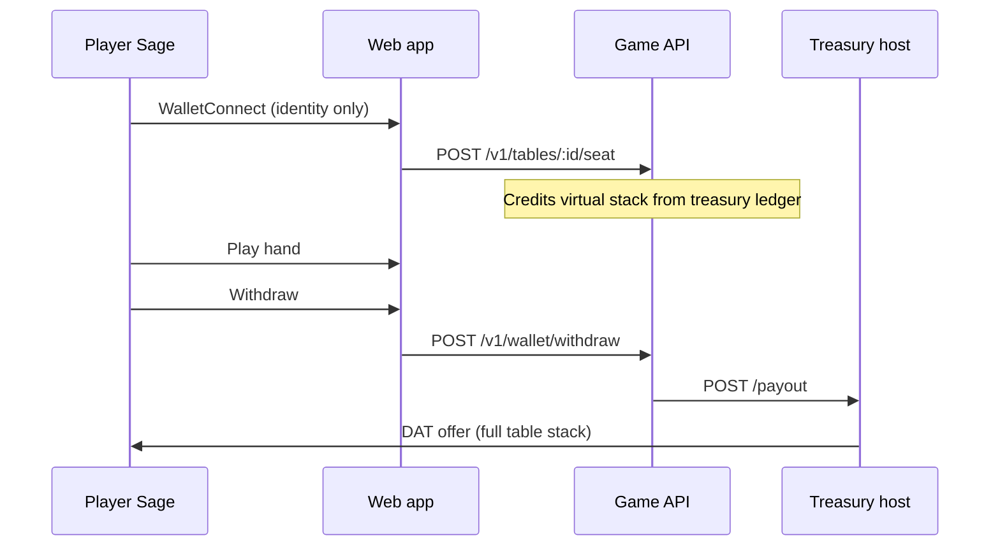

# Hosting external players

This guide covers opening DAT POKER to players outside your LAN and funding their buy-ins from the **treasury host** instead of their own wallets.

## Overview

| Setting | Purpose |
|---------|---------|
| `DAT_BUYIN_FUNDING=treasury` | Operator treasury supplies table chips; players do not need DAT in their wallet to join |
| `DAT_TREASURY_PAYOUT_URL` | Treasury service pays on-chain DAT when players withdraw |
| `API_HOST=0.0.0.0` | API listens on all interfaces |
| `WEB_HOST=0.0.0.0` | Web dev server reachable on your LAN/public IP |
| `VITE_API_URL` | Public API URL baked into production web builds |
| `API_CORS_ORIGINS` | Allowed browser origins for cross-origin API calls |

## Treasury-funded buy-in flow



With `DAT_BUYIN_FUNDING=treasury`:

- Players connect Sage via WalletConnect for **identity** (address) and **withdraw** (takeOffer).
- No DAT balance check or buy-in signature is required at seat time.
- The treasury host records `playerContributionMojos = 0`; withdraw pays the **full table stack** on-chain (net of zero player contribution).

## Game host `.env`

```env
API_HOST=0.0.0.0
API_PORT=4000
WEB_HOST=0.0.0.0
WEB_PORT=5173

# Allow your public web origin (comma-separated)
API_CORS_ORIGINS=https://poker.example.com

WALLETCONNECT_PROJECT_ID=your_wc_project_id
DAT_GOVERNANCE_TOKEN_ASSET_ID=your_64_char_asset_id
DAT_BUYIN_FUNDING=treasury
DAT_TREASURY_PAYOUT_URL=http://10.0.0.50:4200/payout
```

For production web builds:

```bash
VITE_API_URL=https://api.poker.example.com pnpm --filter @dat-poker/web build
```

Serve the `apps/web/dist` folder behind HTTPS (nginx, Caddy, etc.).

## Inviting external players

1. Host creates a table in the web app (**Create table & host**).
2. Copy the **Share with players** link (includes `?table=<uuid>`).
3. Send the link to external players.
4. Guests open the link, connect Sage, click **Identify wallet**, then **Join table**.

Each guest is seated at the next open seat. The host table includes a house bot at seat 1 for heads-up play.

## Network checklist

| Port | Service | Exposure |
|------|---------|----------|
| 4000 | Game API | Public HTTPS (via reverse proxy) |
| 5173 | Web (dev) | Public HTTP/HTTPS for testing |
| 4200 | Treasury payout | **Private** — game API IP only |
| 9257 | Sage RPC | **Localhost only** on treasury host |

- Put TLS termination on API and web (Let's Encrypt, Cloudflare, etc.).
- Do **not** expose treasury Sage RPC (port 9257) or treasury payout to the public internet without IP allowlisting.

## Treasury host

Treasury setup is unchanged — see [TREASURY.md](./TREASURY.md). Fund the treasury Sage wallet with enough DAT for:

- Player buy-ins (virtual ledger exposure)
- Net winnings when players cash out profitably

## Related

- [TREASURY.md](./TREASURY.md) — treasury wallet + payout service
- [WALLETCONNECT.md](./WALLETCONNECT.md) — Sage WalletConnect setup
