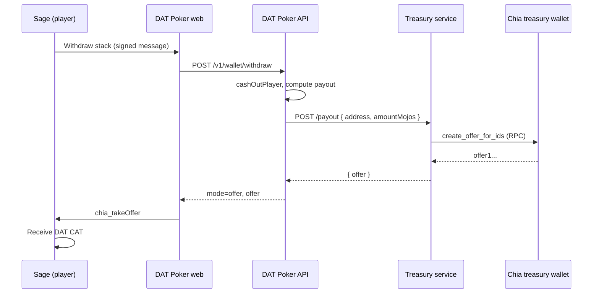

# Treasury wallet setup (DAT withdraw payouts)

Players withdraw table winnings through the web app. When the treasury is configured, the API asks the **treasury payout service** to build a Chia **offer**; the player accepts it in **Sage** via WalletConnect (`chia_takeOffer`) and receives DAT on-chain.



## What you need

| Component | Purpose |
|-----------|---------|
| **Chia wallet (treasury)** | Hot wallet holding DAT + a little XCH for fees; exposes RPC on port 9256 |
| **Treasury payout service** | `pnpm dev:treasury` — builds offers via wallet RPC |
| **DAT Poker API** | Points at treasury with `DAT_TREASURY_PAYOUT_URL` |
| **Player Sage wallet** | Takes the offer after withdraw (already used for buy-in/play) |

Buy-in is still **virtual** (DAT stays in the player wallet during play). Default payout mode is **`net`**: only **winnings** are sent on-chain (`stack − original buy-in`). Example: buy in 1000 DAT, leave with 1050 stack → treasury pays **50 DAT**.

---

## Step 1 — Chia treasury wallet

Use a **dedicated** wallet (not your personal Sage). The [Chia reference wallet](https://docs.chia.net/installation/) or any node that exposes the standard wallet RPC works.

1. Install Chia and sync mainnet (or your target network).
2. Create or import a wallet fingerprint used only for payouts.
3. **Add the DAT CAT** (same `asset_id` as `DAT_GOVERNANCE_TOKEN_ASSET_ID`).
4. **Fund the wallet:**
   - Enough **DAT** to cover expected net winnings (start with a buffer).
   - A small amount of **XCH** for offer/mempool fees.
5. Keep **`chia wallet` / wallet RPC running** on the same machine as the treasury service.

### Wallet RPC TLS cert paths

The treasury service talks to `https://127.0.0.1:9256` with client certificates.

**Official Chia (typical):**

```text
~/.chia/mainnet/config/ssl/wallet/private_wallet.crt
~/.chia/mainnet/config/ssl/wallet/private_wallet.key
```

**Some installs (e.g. xch-chia):**

```text
~/.local/share/xch-chia/mainnet/config/ssl/wallet/private_wallet.crt
~/.local/share/xch-chia/mainnet/config/ssl/wallet/private_wallet.key
```

Verify RPC is up:

```bash
chia rpc wallet get_routes
# or with curl + certs — see treasury health below
```

---

## Step 2 — Configure `.env`

Copy from `.env.example` and set at minimum:

```env
# Shared DAT asset (same on API + treasury)
DAT_GOVERNANCE_TOKEN_ASSET_ID=your_64_char_asset_id
DAT_GOVERNANCE_TOKEN_TICKER=DAT

# API → treasury
DAT_TREASURY_PAYOUT_URL=http://localhost:4200/payout
DAT_WITHDRAW_PAYOUT_MODE=net
DAT_WITHDRAW_FEE_MOJOS=0

# Treasury service
TREASURY_PORT=4200
TREASURY_OFFER_MODE=rpc
TREASURY_WALLET_RPC_URL=https://127.0.0.1:9256
TREASURY_WALLET_CERT_PATH=~/.chia/mainnet/config/ssl/wallet/private_wallet.crt
TREASURY_WALLET_KEY_PATH=~/.chia/mainnet/config/ssl/wallet/private_wallet.key
TREASURY_PAYOUT_FEE_MOJOS=0
```

| Variable | Notes |
|----------|--------|
| `TREASURY_OFFER_MODE=mock` | Dev only — fake offers, no on-chain DAT (Sage skip) |
| `TREASURY_OFFER_MODE=rpc` | Production — real offers from treasury wallet |
| `DAT_WITHDRAW_PAYOUT_MODE=net` | Pay winnings only (virtual buy-in) |
| `DAT_WITHDRAW_PAYOUT_MODE=full` | Pay full table stack (when buy-in is on-chain escrow) |

For production, run the treasury service on a private network and set:

```env
DAT_TREASURY_PAYOUT_URL=http://your-treasury-host:4200/payout
```

---

## Step 3 — Start services

Three terminals from repo root:

```bash
pnpm install
pnpm build

# Terminal 1 — game API
pnpm dev:api

# Terminal 2 — treasury offer builder
pnpm dev:treasury

# Terminal 3 — web UI
pnpm dev:web
```

Open http://localhost:5173

---

## Step 4 — Verify treasury health

```bash
curl -s http://localhost:4200/health | jq
```

Expected when RPC is wired correctly:

```json
{
  "status": "ok",
  "offerMode": "rpc",
  "assetId": "d12fbf63…",
  "walletRpcUrl": "https://127.0.0.1:9256",
  "walletConfigured": true,
  "walletRpcReachable": true
}
```

If `walletRpcReachable` is `false`, check Chia wallet is running, cert paths, and firewall.

API should report treasury configured:

```bash
curl -s http://localhost:4000/v1/wallet/status | jq
```

---

## Step 5 — Test a payout offer (optional)

Dry-run offer creation (uses real wallet coins when `TREASURY_OFFER_MODE=rpc`):

```bash
curl -s -X POST http://localhost:4200/payout \
  -H 'content-type: application/json' \
  -d '{
    "address": "xch1yourplayeraddress…",
    "amountMojos": "50000"
  }' | jq
```

Response should include `"offer": "offer1…"` (not `mock-offer:`).

---

## Step 6 — Player withdraw flow

1. Connect Sage, load DAT balance, **buy in & join table** (1000 DAT).
2. Play a hand and **win** (stack > buy-in).
3. When no hand is active, click **Withdraw … to Sage**.
4. Approve the **withdraw message** in Sage.
5. Approve the **treasury offer** in Sage (`takeOffer`) — DAT arrives in the player wallet.

Net payout example: stack 1_050_000 mojos, buy-in 1_000_000 mojos → treasury offer for **50_000 mojos (50 DAT)**.

---

## Troubleshooting

| Symptom | Fix |
|---------|-----|
| Withdraw succeeds but no Sage offer prompt | Set `DAT_TREASURY_PAYOUT_URL`; ensure treasury is running |
| `walletRpcReachable: false` | Start Chia wallet; fix cert paths (`~` is expanded automatically) |
| `Treasury wallet did not return an offer` | Treasury wallet lacks spendable DAT coins for that amount |
| Offer fails in Sage | Treasury needs XCH for fees; increase `TREASURY_PAYOUT_FEE_MOJOS` / `DAT_WITHDRAW_FEE_MOJOS` |
| `mock-offer:` in logs | `TREASURY_OFFER_MODE=mock` — switch to `rpc` for mainnet |
| Payout 0 DAT | `net` mode and stack ≤ buy-in (no net winnings) — table still clears |

---

## Security notes

- Run treasury on a locked-down host; restrict `:4200` to the API only.
- Use a dedicated payout wallet; rotate and reconcile balances regularly.
- See [SECURITY.md](./SECURITY.md) for production treasury guidance (HSM, limits, audit).

## Related

- [WALLETCONNECT.md](./WALLETCONNECT.md) — Sage connect, buy-in, play
- [DAT_TOKEN.md](./DAT_TOKEN.md) — CAT asset and funding architecture
