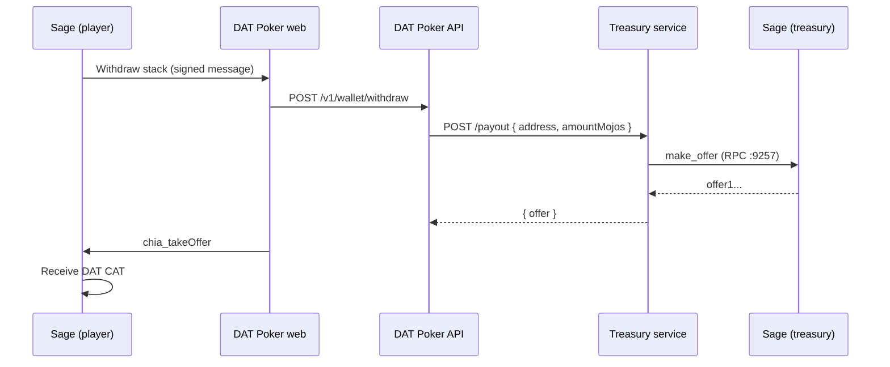

# Treasury wallet setup (Sage + DAT withdraw)

Players withdraw table winnings through the web app. The **treasury payout service** uses **Sage wallet RPC** to build a Chia offer; the player accepts it in their **player Sage wallet** via WalletConnect (`chia_takeOffer`).



## Two Sage wallets

| Wallet | Role | How it connects |
|--------|------|-----------------|
| **Treasury Sage** | Holds DAT pool, creates payout offers | Local RPC on `https://127.0.0.1:9257` |
| **Player Sage** | Buy-in, play, take offers | WalletConnect from web app |

Use a **separate Sage key/fingerprint** for treasury — not the same profile players use to play.

**Treasury Sage and player Sage are always on different machines in production.** The player wallet is on the user's phone or PC; the treasury wallet stays on an operator-controlled host. They never share a device.

---

## Multi-machine layout (production)

```text
┌─────────────────────────────┐     ┌──────────────────────────────┐
│  Player device              │     │  Treasury host (operator)    │
│  Sage + browser             │     │  Sage (treasury fingerprint) │
│  WalletConnect ────────────────►│  RPC :9257 (localhost only)  │
│  takeOffer on withdraw      │     │  treasury-payout :4200       │
└──────────────┬──────────────┘     └──────────────▲───────────────┘
               │                                    │
               │ HTTPS                              │ HTTP (private)
               ▼                                    │
┌─────────────────────────────┐     POST /payout   │
│  Game host (API + web)      │────────────────────┘
│  pnpm dev:api  :4000        │
│  pnpm dev:web  :5173        │
└─────────────────────────────┘
```

| Machine | Runs | Must NOT |
|---------|------|----------|
| **Player phone/PC** | Sage (player key), browser → your web app | Hold treasury DAT |
| **Game host** | `dev:api`, `dev:web` (or deployed equivalents) | Expose Sage RPC; hold treasury keys |
| **Treasury host** | Sage (treasury key), `pnpm dev:treasury` | Be reachable by players directly |

### Game host `.env` (API + web)

Set the treasury URL to the **treasury host** on your private network — not `localhost` unless everything runs on one box for dev:

```env
# Point at treasury machine (example private IP)
DAT_TREASURY_PAYOUT_URL=http://10.0.0.50:4200/payout

WALLETCONNECT_PROJECT_ID=...
DAT_GOVERNANCE_TOKEN_ASSET_ID=...
```

Players only talk to the **game host** (web + API). They never connect to the treasury host.

### Treasury host `.env`

Runs **only** on the machine where treasury Sage is open:

```env
DAT_GOVERNANCE_TOKEN_ASSET_ID=...   # same asset id as game host

TREASURY_OFFER_MODE=rpc
TREASURY_WALLET_BACKEND=sage
TREASURY_WALLET_RPC_URL=https://127.0.0.1:9257   # always local to this machine
TREASURY_SAGE_FINGERPRINT=...
TREASURY_HOST=0.0.0.0                            # listen for API server
TREASURY_PORT=4200
```

Sage RPC (`9257`) stays **localhost-only**. Firewall `:4200` so **only the game API server IP** can call `/payout` — not the public internet.

---

## Step 1 — Treasury Sage wallet

### Desktop (recommended to start)

1. Install [Sage](https://github.com/xch-dev/sage/releases) on the machine running the treasury service.
2. Create or import a **dedicated treasury key** (new fingerprint).
3. Add your **DAT CAT** (`DAT_GOVERNANCE_TOKEN_ASSET_ID`).
4. Fund the wallet:
   - **DAT** for net winnings payouts
   - **XCH** for offer/mempool fees
5. **Enable RPC:** Sage → **Settings → Advanced** → start RPC server (port **9257**).
6. Optional: enable **start RPC automatically** when Sage opens.

### Headless server (production)

Install Sage CLI and run RPC in the foreground (do **not** run GUI RPC at the same time):

```bash
cargo install --git https://github.com/xch-dev/sage --tag v0.11.1 sage-cli
sage rpc start
# In another terminal, login to treasury fingerprint:
sage rpc login '{"fingerprint": YOUR_TREASURY_FINGERPRINT}'
```

See [Sage RPC setup](https://docs.xch.dev/rpc/setup/).

### SSL certificates (auto-detected on Linux)

The treasury service auto-finds Sage certs at:

```text
~/.local/share/sage/ssl/wallet.crt
~/.local/share/sage/ssl/wallet.key
```

Also checked: `~/.local/share/com.rigidnetwork.sage/ssl/`

Override with `TREASURY_WALLET_CERT_PATH` / `TREASURY_WALLET_KEY_PATH` if needed.

---

## Step 2 — Configure `.env`

### Treasury host (same machine as treasury Sage)

```env
DAT_GOVERNANCE_TOKEN_ASSET_ID=your_64_char_asset_id

# API → treasury service
DAT_TREASURY_PAYOUT_URL=http://localhost:4200/payout
DAT_WITHDRAW_PAYOUT_MODE=net

# Treasury service → Sage RPC
TREASURY_WALLET_BACKEND=sage
TREASURY_OFFER_MODE=rpc
TREASURY_WALLET_RPC_URL=https://127.0.0.1:9257
TREASURY_SAGE_FINGERPRINT=1234567890
# Certs auto-detected; override if needed:
# TREASURY_WALLET_CERT_PATH=~/.local/share/sage/ssl/wallet.crt
# TREASURY_WALLET_KEY_PATH=~/.local/share/sage/ssl/wallet.key
TREASURY_PAYOUT_FEE_MOJOS=0
```

### Game host (API + web — can be a different computer)

```env
DAT_GOVERNANCE_TOKEN_ASSET_ID=your_64_char_asset_id
DAT_TREASURY_PAYOUT_URL=http://TREASURY_HOST_IP:4200/payout
DAT_WITHDRAW_PAYOUT_MODE=net
WALLETCONNECT_PROJECT_ID=...
# No TREASURY_SAGE_* vars needed here — treasury service runs elsewhere
```

| Variable | Notes |
|----------|--------|
| `TREASURY_SAGE_FINGERPRINT` | Treasury key fingerprint — service calls `login` before `make_offer` |
| `TREASURY_OFFER_MODE=mock` | Dev only — fake offers, no on-chain DAT |
| `DAT_WITHDRAW_PAYOUT_MODE=net` | Pay winnings only (virtual buy-in): stack − buy-in |
| `TREASURY_WALLET_BACKEND=chia` | Legacy reference wallet only (not recommended) |

---

## Step 3 — Start services

**Treasury host** (treasury Sage must be open with RPC enabled):

```bash
pnpm dev:treasury   # listens on :4200
```

**Game host**:

```bash
pnpm dev:api
pnpm dev:web
```

**Player device**: open your web URL, connect Sage via WalletConnect — no install on game/treasury servers.

For local all-in-one dev, run everything on one machine; use `DAT_TREASURY_PAYOUT_URL=http://localhost:4200/payout`.

---

## Step 4 — Verify

```bash
curl -s http://localhost:4200/health | jq
```

Expected:

```json
{
  "status": "ok",
  "offerMode": "rpc",
  "walletBackend": "sage",
  "walletRpcUrl": "https://127.0.0.1:9257",
  "walletConfigured": true,
  "walletRpcReachable": true,
  "sageFingerprint": 1234567890
}
```

Test offer creation:

```bash
curl -s -X POST http://localhost:4200/payout \
  -H 'content-type: application/json' \
  -d '{"address":"xch1yourplayeraddress…","amountMojos":"50000"}' | jq
```

Should return `"offer": "offer1…"`.

List Sage fingerprints:

```bash
# With sage-cli while RPC is running:
sage rpc get_keys '{}'
```

---

## Step 5 — Player withdraw

1. Player connects **their own Sage** via WalletConnect → buy in → play → win.
2. Click **Withdraw … to Sage** → sign withdraw message.
3. Accept **treasury offer** in Sage → DAT arrives on-chain.

Net payout example: 1000 DAT buy-in, 1050 stack → treasury offers **50 DAT** (`50000` mojos).

---

## Troubleshooting

| Symptom | Fix |
|---------|-----|
| `walletRpcReachable: false` | Enable RPC in Sage Settings → Advanced; keep Sage open |
| Certs not found | Check `~/.local/share/sage/ssl/` or set cert paths in `.env` |
| Login / fingerprint errors | Set `TREASURY_SAGE_FINGERPRINT`; run `sage rpc login` manually |
| No offer returned | Treasury Sage needs spendable DAT + XCH for fees |
| GUI + CLI RPC conflict | Run only one Sage RPC at a time |
| Player sees no offer | Set `DAT_TREASURY_PAYOUT_URL`; ensure treasury service is up |

---

## Security

- **Never expose Sage RPC port 9257** to the network — treasury service talks to `127.0.0.1` on the treasury host only.
- Restrict treasury service port **4200** to the game API server IP (VPN or private subnet).
- Players never touch the treasury host; offers are delivered through the API → web → WalletConnect.
- Use a dedicated treasury fingerprint with limited DAT balance.

## Related

- [WALLETCONNECT.md](./WALLETCONNECT.md) — player Sage + WalletConnect
- [Sage RPC docs](https://docs.xch.dev/rpc/setup/)
