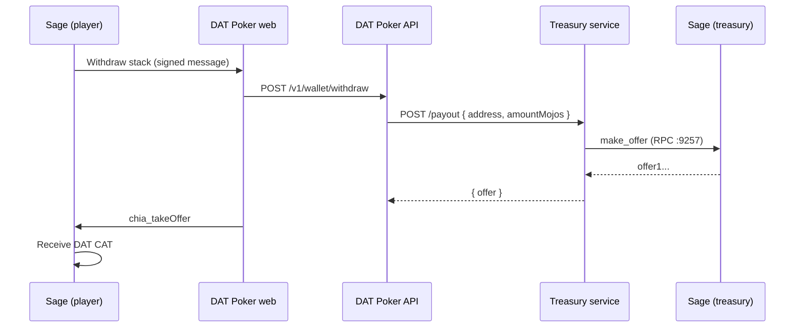

# Treasury wallet setup (Sage + DAT withdraw)

Players withdraw table winnings through the web app. The **treasury payout service** uses **Sage wallet RPC** to build a Chia offer; the player accepts it in their **player Sage wallet** via WalletConnect (`chia_takeOffer`).


```mermaid
sequenceDiagram
  participant Player as Sage (player)
  participant Web as DAT Poker web
  participant API as DAT Poker API
  participant Treasury as Treasury service
  participant Sage as Sage (treasury)

  Player->>Web: Withdraw stack (signed message)
  Web->>API: POST /v1/wallet/withdraw
  API->>Treasury: POST /payout { address, amountMojos }
  Treasury->>Sage: make_offer (RPC :9257)
  Sage-->>Treasury: offer1...
  Treasury-->>API: { offer }
  Web->>Player: chia_takeOffer
  Player->>Player: Receive DAT CAT
```

## Two Sage wallets

| Wallet | Role | How it connects |
|--------|------|-----------------|
| **Treasury Sage** | Holds DAT pool, creates payout offers | Local RPC on `https://127.0.0.1:9257` |
| **Player Sage** | Buy-in, play, take offers | WalletConnect from web app |

Use a **separate Sage key/fingerprint** for treasury — not the same profile players use to play.

A payout to the treasury Sage address cannot show as a new deposit (it is a self-transfer, and an untaken offer can lock those coins). Set `TREASURY_XCH_ADDRESS` so `/payout` rejects that address.

When treasury is reachable, withdraw returns an `offer1…` string and the site asks player Sage (`chia_takeOffer`) to show an Accept popup. If that pairing is older or the popup does not appear, import the offer in **player** Sage (Offers → Import).

**Player Sage stays on the user's phone or PC.** Treasury Sage is operator-controlled and never shares that device.

---

## AWS website host (beta)

On the public beta EC2 box, treasury HTTP is part of the website:

| Unit | Bind | Lifetime |
|------|------|----------|
| `dat-poker-api` | `:4000` (proxied by nginx/Caddy) | Enabled at boot, restarted on every redeploy |
| `dat-poker-treasury` | `127.0.0.1:4200` | Same — enabled at boot, `Restart=always`, restarted on every redeploy |

`user-data.sh` and `redeploy.sh` persist:

```env
DAT_TREASURY_PAYOUT_URL=http://127.0.0.1:4200/payout
DAT_ENABLE_ONCHAIN_WITHDRAW=true
TREASURY_HOST=127.0.0.1
TREASURY_PORT=4200
```

Do not expose `:4200` or Sage RPC `:9257` in the security group. After redeploy:

```bash
sudo DAT_POKER_REPO_REF=cursor/sng-sage-unlock-3440 bash /opt/dat-poker/deploy/aws-ec2/redeploy.sh
curl -sS http://127.0.0.1:4200/health
curl -sS http://127.0.0.1:4000/v1/wallet/status
```

Treasury HTTP can be healthy while Sage RPC certs are missing. That is the
`Sage treasury RPC not configured` / `wallet.crt` withdraw error. Real offers
need Sage RPC on **this** AWS host:

```bash
sudo bash /opt/dat-poker/deploy/aws-ec2/enable-treasury-sage.sh
# first time, copies the prebuilt sage-cli built for Amazon Linux 2023 (glibc 2.34):
sudo SAGE_INSTALL=1 bash /opt/dat-poker/deploy/aws-ec2/enable-treasury-sage.sh
# Load the dedicated treasury spend key (not wallet.key). Prefer a file or silent TTY:
sudo bash /opt/dat-poker/deploy/aws-ec2/load-treasury-key.sh
sudo TREASURY_SAGE_PRIVATE_KEY_FILE=/root/treasury.hex bash /opt/dat-poker/deploy/aws-ec2/load-treasury-key.sh
```

`dat-poker-sage-rpc` stays enabled with the website (`:9257`, localhost only).
Player Sage stays on the tester phone/PC. `start-treasury.sh` is only a repair
path if the HTTP unit is down.

### Rotate the treasury spend key

After a withdraw works — or if the current key was pasted in SSH or chat —
load a **new** dedicated key. The wrapper always replaces Sage's logged-in
fingerprint and writes the new `TREASURY_SAGE_FINGERPRINT` / receive address:

```bash
sudo bash /opt/dat-poker/deploy/aws-ec2/load-treasury-key.sh
# or, from a root-only file (delete the file after it succeeds):
sudo TREASURY_SAGE_PRIVATE_KEY_FILE=/root/treasury.hex bash /opt/dat-poker/deploy/aws-ec2/load-treasury-key.sh
# keep the previous fingerprint in Sage (default is to delete it):
sudo SAGE_KEEP_OLD_KEY=1 bash /opt/dat-poker/deploy/aws-ec2/load-treasury-key.sh
```

The script does not print the secret. Fund the new treasury address with DAT
and fee XCH before the next withdraw. Player Sage stays off this host.

---

## Treasury host quick start

Use the AWS website host above for beta. A dedicated machine is optional if you later split treasury off the game box.

1. **Clone the repo** on the treasury host and install deps:
   ```bash
   git clone https://github.com/Drewski241/dat-poker.git
   cd dat-poker && pnpm install && pnpm build
   ```

2. **Install Sage** and create a **new treasury key** (not your player wallet):
   - [Sage releases](https://github.com/xch-dev/sage/releases)
   - Add the DAT CAT (`DAT_GOVERNANCE_TOKEN_ASSET_ID`)
   - Fund with **DAT** (payout pool) and **XCH** (fees)
   - **Settings → Advanced** → enable RPC (port **9257**), keep Sage open

3. **Configure env** — copy the treasury template and fill in values:
   ```bash
   cp .env.treasury.example .env
   # Edit .env: asset id + TREASURY_SAGE_FINGERPRINT
   ```

4. **Verify Sage + env** before starting the service:
   ```bash
   pnpm treasury:check
   ```
   All checks should pass (asset id, certs, RPC reachable, fingerprint login).

5. **Start treasury payout service**:
   ```bash
   pnpm dev:treasury
   # Production: pnpm treasury:start
   ```

6. **Confirm health**:
   ```bash
   curl -s http://localhost:4200/health | jq
   ```
   Expect `"walletRpcReachable": true`.

7. **Lock down networking**:
   - Sage RPC **9257** — localhost only (never expose)
   - Treasury **4200** — allow **only** your game API server IP

8. **On the game host**, set:
   ```env
   DAT_TREASURY_PAYOUT_URL=http://<TREASURY_PRIVATE_IP>:4200/payout
   ```

---

## Multi-machine layout (production)

```text
┌─────────────────────────────┐     ┌──────────────────────────────┐
│  Player device              │     │  Treasury host (operator)    │
│  Sage + browser             │     │  Sage (treasury fingerprint) │
│  WalletConnect ────────────────►│  RPC :9257 (localhost only)  │
│  takeOffer on withdraw      │     │  treasury-payout :4200       │
└──────────────┬──────────────┘     └──────────────▲───────────────┘
               │                                    │
               │ HTTPS                              │ HTTP (private)
               ▼                                    │
┌─────────────────────────────┐     POST /payout   │
│  Game host (API + web)      │────────────────────┘
│  pnpm dev:api  :4000        │
│  pnpm dev:web  :5173        │
└─────────────────────────────┘
```

| Machine | Runs | Must NOT |
|---------|------|----------|
| **Player phone/PC** | Sage (player key), browser → your web app | Hold treasury DAT |
| **Game host** | `dev:api`, `dev:web` (or deployed equivalents) | Expose Sage RPC or `:4200` publicly |
| **Treasury host** | Sage (treasury key), `pnpm dev:treasury` | Be reachable by players directly |

### Game host `.env` (API + web)

Set the treasury URL to the **treasury host** on your private network — not `localhost` unless everything runs on one box for dev:

```env
# Point at treasury machine (example private IP)
DAT_TREASURY_PAYOUT_URL=http://10.0.0.50:4200/payout

WALLETCONNECT_PROJECT_ID=...
DAT_GOVERNANCE_TOKEN_ASSET_ID=...
```

Players only talk to the **game host** (web + API). They never connect to the treasury host.

### Treasury host `.env`

Runs **only** on the machine where treasury Sage is open:

```env
DAT_GOVERNANCE_TOKEN_ASSET_ID=...   # same asset id as game host

TREASURY_OFFER_MODE=rpc
TREASURY_WALLET_BACKEND=sage
TREASURY_WALLET_RPC_URL=https://127.0.0.1:9257   # always local to this machine
TREASURY_SAGE_FINGERPRINT=...
TREASURY_HOST=0.0.0.0                            # listen for API server
TREASURY_PORT=4200
```

Sage RPC (`9257`) stays **localhost-only**. Firewall `:4200` so **only the game API server IP** can call `/payout` — not the public internet.

---

## Step 1 — Treasury Sage wallet

### Desktop (recommended to start)

1. Install [Sage](https://github.com/xch-dev/sage/releases) on the machine running the treasury service.
2. Create or import a **dedicated treasury key** (new fingerprint).
3. Add your **DAT CAT** (`DAT_GOVERNANCE_TOKEN_ASSET_ID`).
4. Fund the wallet:
   - **DAT** for net winnings payouts
   - **XCH** for offer/mempool fees
5. **Enable RPC:** Sage → **Settings → Advanced** → start RPC server (port **9257**).
6. Optional: enable **start RPC automatically** when Sage opens.

### Headless server (production)

Install Sage CLI and run RPC in the foreground (do **not** run GUI RPC at the same time):

```bash
# On the AWS website host, use the prebuilt binary (cargo install fills a 20 GB volume):
sudo SAGE_INSTALL=1 bash /opt/dat-poker/deploy/aws-ec2/enable-treasury-sage.sh
sage rpc start
# In another terminal, login to treasury fingerprint:
sage rpc login '{"fingerprint": YOUR_TREASURY_FINGERPRINT}'
```

See [Sage RPC setup](https://docs.xch.dev/rpc/setup/).

### SSL certificates (auto-detected on Linux)

The treasury service auto-finds Sage certs at:

```text
~/.local/share/sage/ssl/wallet.crt
~/.local/share/sage/ssl/wallet.key
```

Also checked: `~/.local/share/com.rigidnetwork.sage/ssl/`

Override with `TREASURY_WALLET_CERT_PATH` / `TREASURY_WALLET_KEY_PATH` if needed.

---

## Step 2 — Configure `.env`

On the treasury host, start from `.env.treasury.example`:

```bash
cp .env.treasury.example .env
```

### Treasury host (same machine as treasury Sage)

```env
DAT_GOVERNANCE_TOKEN_ASSET_ID=your_64_char_asset_id

# API → treasury service
DAT_TREASURY_PAYOUT_URL=http://localhost:4200/payout
DAT_WITHDRAW_PAYOUT_MODE=net

# Treasury service → Sage RPC
TREASURY_WALLET_BACKEND=sage
TREASURY_OFFER_MODE=rpc
TREASURY_WALLET_RPC_URL=https://127.0.0.1:9257
TREASURY_SAGE_FINGERPRINT=1234567890
# Certs auto-detected; override if needed:
# TREASURY_WALLET_CERT_PATH=~/.local/share/sage/ssl/wallet.crt
# TREASURY_WALLET_KEY_PATH=~/.local/share/sage/ssl/wallet.key
TREASURY_PAYOUT_FEE_MOJOS=0
# Player Accept fee (XCH mojos). 0 uses 0.000001 XCH.
# DAT_WITHDRAW_FEE_MOJOS=1000000
```

### Game host (API + web — can be a different computer)

```env
DAT_GOVERNANCE_TOKEN_ASSET_ID=your_64_char_asset_id
DAT_TREASURY_PAYOUT_URL=http://TREASURY_HOST_IP:4200/payout
DAT_WITHDRAW_PAYOUT_MODE=net
# Player Sage XCH fee on Accept. 1000000 mojos = 0.000001 XCH.
DAT_WITHDRAW_FEE_MOJOS=1000000
WALLETCONNECT_PROJECT_ID=...
# No TREASURY_SAGE_* vars needed here — treasury service runs elsewhere
```

| Variable | Notes |
|----------|--------|
| `TREASURY_SAGE_PRIVATE_KEY` | Dedicated treasury spend key (hex/bech32). Imported into Sage RPC. Not `wallet.key`. |
| `TREASURY_SAGE_MNEMONIC` | Same as the private key, if you have 12/24 words instead |
| `TREASURY_SAGE_PRIVATE_KEY_FILE` | One-shot path for `load-treasury-key.sh` (64 hex or 12/24 words). Do not leave the file on disk. |
| `TREASURY_SAGE_FINGERPRINT` | Set after import — service calls `login` before `make_offer` |
| `TREASURY_OFFER_MODE=mock` | Dev only — fake offers, no on-chain DAT |
| `DAT_WITHDRAW_PAYOUT_MODE=net` | Pay winnings only (virtual buy-in): stack − buy-in |
| `DAT_WITHDRAW_FEE_MOJOS` | Player Sage **XCH** fee on Accept (`chia_takeOffer`). Default `1000000` = 0.000001 XCH. `0` or unset uses that default. Player Sage must have spendable XCH. |
| `TREASURY_PAYOUT_FEE_MOJOS` | Treasury Sage **XCH** fee on `make_offer`. Default `0` so an empty-XCH treasury can still create the offer. |
| `TREASURY_WALLET_BACKEND=chia` | Legacy reference wallet only (not recommended) |

---

## Step 3 — Start services

**Treasury host** (treasury Sage must be open with RPC enabled):

```bash
pnpm treasury:check   # optional but recommended first
pnpm dev:treasury     # listens on :4200 (watch mode)
# pnpm treasury:start # production (compiled dist/)
```

**Game host**:

```bash
pnpm dev:api
pnpm dev:web
```

**Player device**: open your web URL, connect Sage via WalletConnect — no install on game/treasury servers.

For local all-in-one dev, run everything on one machine; use `DAT_TREASURY_PAYOUT_URL=http://localhost:4200/payout`.

---

## Step 4 — Verify

```bash
curl -s http://localhost:4200/health | jq
```

Expected:

```json
{
  "status": "ok",
  "offerMode": "rpc",
  "walletBackend": "sage",
  "walletRpcUrl": "https://127.0.0.1:9257",
  "walletConfigured": true,
  "walletRpcReachable": true,
  "sageFingerprint": 1234567890
}
```

Test offer creation:

```bash
curl -s -X POST http://localhost:4200/payout \
  -H 'content-type: application/json' \
  -d '{"address":"xch1yourplayeraddress…","amountMojos":"50000"}' | jq
```

Should return `"offer": "offer1…"`.

List Sage fingerprints:

```bash
# With sage-cli while RPC is running:
sage rpc get_keys '{}'
```

---

## Step 5 — Player withdraw

1. On AWS, redeploy so `dat-poker-treasury` is enabled with the website. Confirm `:4200/health`.
   Repair only if the unit is down:
   ```bash
   sudo bash /opt/dat-poker/deploy/aws-ec2/start-treasury.sh
   ```
   Locally: `pnpm treasury:check` then `pnpm treasury:start` with DAT + XCH in treasury Sage.
2. API already points at `http://127.0.0.1:4200/payout` on the website host. Set `TREASURY_XCH_ADDRESS` so payouts cannot target the treasury key.
   If the play page says treasury is not reachable at `127.0.0.1:4200`, the systemd unit is down — redeploy or run `start-treasury.sh`.
3. Player links a **separate** Sage address, unlocks DAT, clicks withdraw.
4. Sage should pop up Accept. Accept spends a small **XCH** fee from **player** Sage (default 0.000001 XCH, `DAT_WITHDRAW_FEE_MOJOS`). That wallet needs spendable XCH — this is not DAT. If no popup appears, copy the offer from the site. In **player Sage** (not treasury): Offers → Import → accept.
5. Player Sage DAT balance increases. Treasury Sage DAT decreases.

Net payout example: 1000 DAT buy-in, 1050 stack → treasury offers **50 DAT** (`50000` mojos).

---

## Troubleshooting

| Symptom | Fix |
|---------|-----|
| `walletRpcReachable: false` | Enable RPC in Sage Settings → Advanced; keep Sage open |
| Certs not found | Check `~/.local/share/sage/ssl/` or set cert paths in `.env` |
| Login / fingerprint errors | Set `TREASURY_SAGE_FINGERPRINT`; run `sage rpc login` manually |
| Need to replace the treasury key | `sudo bash /opt/dat-poker/deploy/aws-ec2/load-treasury-key.sh` |
| `no spendable coins` / `datSelectableMojos: 0` | Sage is logged in but has not indexed DAT yet. After sync, 50000 DAT = `50000000` mojos. Confirm `DAT_GOVERNANCE_TOKEN_ASSET_ID` and send a little XCH for fees to the treasury address from `/health`. |
| `DAT is locked in an unused Sage offer` / `pendingOfferCount` > 0 | The last withdraw built an offer and reserved those DAT coins. Accept failed or was never taken, so the DAT did not leave the treasury key. Retry withdraw (payout now deletes leftover pending/active offers) or `sudo bash /opt/dat-poker/deploy/aws-ec2/release-treasury-offers.sh`. Check `/health` `datBalanceMojos` vs `datSelectableMojos`. |
| No offer returned | Treasury Sage needs spendable DAT + XCH for fees |
| Sage Accept fails / needs a fee | Player Sage pays `DAT_WITHDRAW_FEE_MOJOS` (default 0.000001 XCH) on Accept. Fund **player** Sage with a little XCH. Treasury maker fee is separate (`TREASURY_PAYOUT_FEE_MOJOS`, default 0). |
| GUI + CLI RPC conflict | Run only one Sage RPC at a time |
| Player sees no offer | Confirm `dat-poker-treasury` is active; API `DAT_TREASURY_PAYOUT_URL=http://127.0.0.1:4200/payout` |

---

## Security

- **Never expose Sage RPC port 9257** to the network — treasury service talks to `127.0.0.1` on the treasury host only.
- On the AWS website host, bind treasury to **127.0.0.1:4200** only. If treasury later moves off-box, restrict **4200** to the game API server IP.
- Players never touch the treasury host; offers are delivered through the API → web → WalletConnect.
- Use a dedicated treasury fingerprint with limited DAT balance.
- Rotate with `load-treasury-key.sh` if the spend key was exposed. Do not
  paste the secret into chat or SSH session logs.

## Related

- [WALLETCONNECT.md](./WALLETCONNECT.md) — player Sage + WalletConnect
- [Sage RPC docs](https://docs.xch.dev/rpc/setup/)
